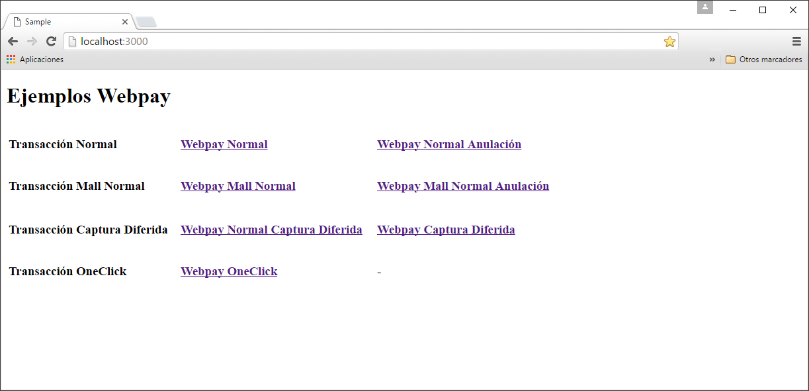
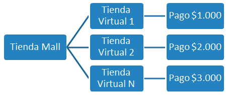

# Descripción
La librería webpay-sdk-ruby está orientada a usuarios con conocimiento intermedios de programación que buscan desarrollar sus propias soluciones de e-commerce. Estas encapsulan métodos de comunicación y cifrado para facilitar la integración de desarrollos propietarios al portal de pago Webpay.

En este manual contiene la descripción básica de clases y métodos necesarios.

# Requisitos

Esta librería fue desarrolla para trabajar sobre un ambiente web conectado a internet que contenga a lo menos:

- Ruby 2.2
- Ruby on rails 4.4
- Único protocolo de comunicación aceptado: TLS 1.2

# Instalación

Descarga el sdk y guárdala en una carpeta de tu computador.

Descomprima el contenido dentro del directorio webroot de su servidor.

Las carpetas incluidas son:

- `libwebpay/`: Carpeta que contiene la gema para instalar librería Webpay
- `sample/`: Ejemplos básicos de utilización en un sitio web con ruby on rails
- `sample/app/views/certificates`: Certificados de de cifrado de ejemplo (solo para ambiente de Integración)

## Nota: Instalación en Windows 
Se debe agregar el certificado de confianza a Windows para que Ruby pueda ser ejecutado de forma segura en este ambiente.

Procedimiento:
Agregar certificado a repositorio de certificados seguros en Windows: Esto se realiza en una consola, ejecutar el comando:

```
"set SSL_CERT_FILE=C:\{Ruta sample}\app\views\certificates\globalCA.pem"
```

## Instalación de la Librería.

Para instalar la librería (en formato de gema) se debe ejecutar el siguiente comando desde la consola, ubicándose en la ruta donde está la gema

```
> gem install libwebpay-2.0.0.gem
```

De esta manera se tendrá disponible para ser usada en el proyecto.

## Ejecución ejemplo.

1. Ubicarse en la ruta del directorio “sample” y ejecutar en consola el comando:

    ```
    > rails server
    ```

    Se levantará un server para ejecución del demo.

2. En el navegador ir a la dirección: http://localhost:3000/, se desplegará un menú para ejecución del pago normal:

    

# Conceptos Básicos

## Certificados

Para la comunicación con Webpay es necesaria la creación de certificados de cifrado. Para su creación, es necesario contar con un código de comercio propio entregado por Transbank, una vez registrado como comercio vía los canales comerciales (mesa ayuda).

En este SDK, se incluyen certificados de prueba creados con un código de comercio genérico, que podrán ser utilizados para fines de prueba e integración.

## Ambientes de trabajo

Para la interacción con los e-commerce, Webpay expone Webservices estilo SOAP firmados digitalmente en distintas URL (encapsulados en esta librería).

Webpay cuenta con 3 ambientes de trabajo, que requerirán distintos códigos de comercio y certificados:
•   Integración: utilizado para realizar desarrollos y pruebas.
•   Certificación: utilizado certificar el portal del comercio antes del lanzamiento.
•   Producción: ambiente oficial con transacciones reales.

Este SDK ya incluye la configuración de las distintas URLs utilizadas por cada ambiente.

Si requiere información acerca de la conexión directa los WebServices SOAP, visite https://www.transbank.cl

## Productos Webpay

Webpay cuenta diversos productos según si requerimientos, los que tendrán que ser acordados con su agente comercial al momento de registrarse como comercio. 

Estos son:
- Webpay Normal: Para transacciones normales con captura y cargo inmediato.
- Webpay Captura Diferida: Cuando requiere reservar crédito del cliente para confirmar la transacción con posterioridad.
- Webpay Mall: Para comercios que sub-agrupan pequeños departamentos y necesitan diferenciar los pagos.
- Webpay Onclick: Para quienes requieren comprar con solo un click (el comercio es responsable frente a fraudes de usurpación de identidad).
- Webpay Anulación: Permite anular transacciones ya realizadas.

Cada producto presenta distintos flujos y datos en sus llamadas, los cuales son descriptos en forma básica en este documento.

# Documentación SDK


## Transacción Webpay normal

Una transacción de autorización normal (o transacción normal), corresponde a una solicitud de autorización financiera de un pago con tarjetas de crédito o débito, en donde quién realiza el pago ingresa al sitio del comercio, selecciona productos o servicio, y el ingreso asociado a los datos de la tarjeta de crédito o débito lo realiza en forma segura en Webpay.


### Configuración

```ruby             
require 'libwebpay'
              
#Se crea objeto para invocar la libreria
libwebpay = Libwebpay.new
              
#se rescatan variables de los certificados              
config = libwebpay.getConfiguration

config.commerce_code = commerce_code
config.environment = environment
config.private_key = private_key
config.public_cert = public_cert
config.webpay_cert = webpay_cert
webpay = libwebpay.getWebpay(config)
```


Parámetro | Tipo | Descripción
--------- | ------- | -----------
commerce_code | String | Código de comercio.
private_key | String | Llave privada.
public_cert | String | Certificado público.
webpay_cert | String | Certificado del servidor
environment | String | Ambiente "INTEGRACION", "CERTIFICACION", "PRODUCCION"


### Iniciar Transacción (initTransaction)

Inicia la transacción devolviendo el id de transacción

```ruby
result = webpay.getNormalTransaction.initTransaction(amount, buyOrder, sessionId, urlReturn, urlFinal)
```

Parámetro | Tipo | Descripción
--------- | ------- | -----------
amount | Integer | Monto.
buyOrder | String | Orden de compra.
sessionId | String | Identificador de sesión.
urlReturn | String | URL retorno. 
urlFinal | String | URL final.

Como resultado se obtiene un `Hash`:

```ruby
if(result['error_desc'] == 'TRX_OK')
  token = result['token']
  url   = result['url']
else 
  error = result['error_desc']
end
```

Retorno | Tipo | Descripción
--------- | ------- | -----------
token |String | Token identificador transacción
url | String | Url webpay.

### Rescatar Resultado (getTransactionResult)

Método que permite obtener el resultado de la transacción y los datos de la misma.

```ruby
result = webpay.getNormalTransaction.getTransactionResult(token)
```

Parámetro | Tipo | Descripción
--------- | ------- | -----------
token | String | Token id de transacción.

En este punto ya hemos confirmado la transacción con Transbank realizando la operación acknowledgeTransaction mediante getTransactionResult. El método debe ser invocado siempre, independientemente del resultado entregado por el método authorize. Si la invocación no se realiza en un período de 40 segundos, Webpay reversará la transacción, asumiendo que el comercio no pudo informarse de su resultado, evitando así el cargo al tarjetahabiente.


```ruby
if(result['error_desc'] == 'TRX_OK')
  accountingdate = result['accountingdate']
  buyorder = result['buyorder']
  cardnumber = result['cardnumber']
  amount = result['amount']
  commercecode = result['commercecode']
  authorizationcode = result['authorizationcode']
  paymenttypecode = result['paymenttypecode']
  responsecode = result['responsecode']
  transactiondate = result['transactiondate']
  urlredirection = result['urlredirection']
  vci = result['vci']
end
```


#### Valores específicos

##### paymentTypeCod

VD = Venta Debito.

VN = Venta Normal.

VC = Venta en cuotas.

SI = 3 cuotas sin interés.

S2 = 2 cuotas sin interés.

NC = N Cuotas sin interés.

##### responseCode

0 Transacción aprobada.

-1 Rechazo de transacción.

-2 Transacción debe reintentarse.

-3 Error en transacción.

-4 Rechazo de transacción.

-5 Rechazo por error de tasa.

-6 Excede cupo máximo mensual.

-7 Excede límite diario por transacción.

-8 Rubro no autorizado.


##### VCI

TSY: Autenticación exitosa.

TSN: autenticación fallida.

TO : Tiempo máximo excedido para autenticación.

ABO: Autenticación abortada por tarjetahabiente.

U3 : Error interno en la autenticación.

Vacío si la transacción no se autentico.

### Finalizar Transacción

Antes de finalizar, se debe redireccionar al voucher de Transbank, luego este re-direccionará al cliente a la URL_FINAL indicando el token. Con los datos almacenados en el paso anterior se puede desplegar el voucher propio del comercio.


## Transacción Mall

Una transacción Mall Normal corresponde a una solicitud de autorización financiera de un conjunto de pagos con tarjetas de crédito o débito, en donde quién realiza el pago ingresa al sitio del comercio, selecciona productos o servicios, y el ingreso asociado a los datos de la tarjeta de crédito o débito lo realiza una única vez en forma segura en Webpay para el conjunto de pagos. Cada pago tendrá su propio resultado, autorizado o rechazado.

El Mall Webpay agrupa múltiples tiendas, son estas últimas las que pueden generar transacciones. Tanto el mall como las tiendas asociadas son identificadas a través de un número denominado código de comercio.




### Configuración

```ruby
#Se crea objeto para invocar la libreria
libwebpay = Libwebpay.new
              
#se rescatan variables de los certificados              
config = libwebpay.getConfiguration

config.commerce_code = commerce_code
config.environment = environment
config.private_key = private_key
config.public_cert = public_cert
config.webpay_cert = webpay_cert
config.store_codes = store_codes
webpay = libwebpay.getWebpay(config)
```
Parámetro | Tipo | Descripción
--------- | ------- | -----------
commerce_code | String | Código de comercio.
private_key | String | Llave privada.
public_cert | String | Certificado público.
webpay_cert | String | Certificado del servidor
environment | String | Ambiente "INTEGRACION", "CERTIFICACION", "PRODUCCION"
store_codes | Array | Códigos de tiendas.

### Iniciar Transacción (initTransaction)

Inicia la transacción devolviendo el id de transacción

```ruby
result = webpay.getMallNormalTransaction.initTransaction(buyOrder, sessionId, urlReturn, urlFinal, stores)
```

Parámetro | Tipo | Descripción
--------- | ------- | -----------
buyOrder | String | Orden de compra.
sessionId | String | Identificador de sesión (Opcional).
urlReturn | String | URL retorno. 
urlFinal | String | URL final.
stores | Array | Arreglo de `Hash`s con datos de tiendas.

Cada elemento dentro de `stores` es un `Hash` con los siguientes elementos:

Key | Tipo | Valor
--------- | ------- | -----------
storeCode  | Integer | Código de Tienda.
amount | Integer | Monto.
buyOrder | String | Orden de compra.
sessionId | String | Identificador de sesión (Opcional).

Como resultado se obtiene un `Hash`:

```ruby
if(result['error_desc'] == 'TRX_OK')
  token = result['token']
  url   = result['url']
else 
  error = result['error_desc']
end
```

Retorno | Tipo | Descripción
--------- | ------- | -----------
token |String | Token identificador transacción
url | String | Url webpay.

### Rescatar Resultado (getTransactionResult)

Permite obtener el resultado de la transacción una vez que Webpay ha resuelto su autorización financiera.

 ```ruby
 result = webpay.getMallNormalTransaction.getTransactionResult(token)
 ```

Parámetro | Tipo | Descripción
--------- | ------- | -----------
token | String | Token id de transacción.

En este punto ya hemos confirmado la transacción con Transbank realizando la operación acknowledgeTransaction mediante getTransactionResult. El método debe ser invocado siempre, independientemente del resultado entregado por el método authorize. Si la invocación no se realiza en un período de 40 segundos, Webpay reversará la transacción, asumiendo que el comercio no pudo informarse de su resultado, evitando así el cargo al tarjetahabiente.

Como resultado se obtiene un `Hash`:

```ruby
if(result['error_desc'] == 'TRX_OK')
  accountingDate = result['accountingDate']
  buyOrder = result['buyOrder']
  cardNumber = result['cardNumber']
  #Si se tiene mas de dos comercios, es recomendable utilizar un ciclo foreach
  detailOutput1 = Nokogiri::HTML(result['detailOutput1'])
  detailOutput2 = Nokogiri::HTML(result['detailOutput2'])
  sessionId = result['sessionId']
  transactionDate = result['transactionDate']
  urlRedirection = result['urlRedirection']
  vci = result['vci']
end
```

Retorno | Tipo | Descripción
--------- | ------- | -----------
buyOrder | String | Orden de compra.
sessionId | String | Identificador de sesión.
cardDetails | carddetails | Datos de tarjeta de crédito.
accoutingDate | String | Fecha de la autorización
transactionDate | String | Fecha, hora de la autorización.
VCI | String | Resultado de la autenticación.
urlRedirection | String | URL de redirección.
detailsOutput | wsTransactionDetailOutput | Detalle de transacción financiera.


#### Valores específicos

##### paymentTypeCod

VD = Venta Debito.

VN = Venta Normal.

VC = Venta en cuotas.

SI = 3 cuotas sin interés.

S2 = 2 cuotas sin interés.

NC = N Cuotas sin interés.

##### responseCode

0 Transacción aprobada.

-1 Rechazo de transacción.

-2 Transacción debe reintentarse.

-3 Error en transacción.

-4 Rechazo de transacción.

-5 Rechazo por error de tasa.

-6 Excede cupo máximo mensual.

-7 Excede límite diario por transacción.

-8 Rubro no autorizado.


##### VCI

TSY: Autenticación exitosa.

TSN: autenticación fallida.

TO : Tiempo máximo excedido para autenticación.

ABO: Autenticación abortada por tarjetahabiente.

U3 : Error interno en la autenticación.

Vacío si la transacción no se autentico.

### Finalizar Transacción

Antes de finalizar, se debe redireccionar al voucher de Transbank, luego este re-direccionará al cliente a la URL_FINAL indicando el token. Con los datos almacenados en el paso anterior se puede desplegar el voucher propio del comercio.


## Transacción Oneclick

La modalidad de pago Oneclick permite al tarjetahabiente realizar pagos en el comercio sin la necesidad de ingresar cada vez información de la tarjeta de crédito al momento de realizar la compra. El modelo de pago contempla un proceso previo de inscripción o enrolamiento del tarjetahabiente, a través del comercio, que desee utilizar el servicio. Este tipo de pago facilita la venta, disminuye el tiempo de la transacción y reduce los riesgos de ingreso erróneo de los datos del medio de pago.

### Configuración


```ruby             
require 'libwebpay'
              
#Se crea objeto para invocar la libreria
libwebpay = Libwebpay.new
              
#se rescatan variables de los certificados              
config = libwebpay.getConfiguration

config.commerce_code = commerce_code
config.environment = environment
config.private_key = private_key
config.public_cert = public_cert
config.webpay_cert = webpay_cert
webpay = libwebpay.getWebpay(config)
```


Parámetro | Tipo | Descripción
--------- | ------- | -----------
commerce_code | String | Código de comercio.
private_key | String | Llave privada.
public_cert | String | Certificado público.
webpay_cert | String | Certificado del servidor
environment | String | Ambiente "INTEGRACION", "CERTIFICACION", "PRODUCCION"

### Iniciar Inscripción (initInscription)

Permite realizar la inscripción del tarjetahabiente e información de su tarjeta de crédito. Retorna como respuesta un token que representa la transacción de inscripción y una URL (UrlWebpay), que corresponde a la URL de inscripción de One Click. Una vez que se llama a este servicio Web, el usuario debe ser redireccionado vía POST a urlWebpay con parámetro TBK_TOKEN igual al token obtenido.

 ```ruby
result = webpay.getOneClickTransaction.initInscription(username, email, urlReturn)
```

Parámetro | Tipo | Descripción
--------- | ------- | -----------
username | String |  Nombre de usuario o cliente en el sistema del comercio.
email | String | Dirección de correo electrónico registrada por el comercio.
urlReturn | String | URL de retorno.


Como resultado se obtiene un `Hash`:

```ruby
if(result['error_desc'] == 'TRX_OK')
  token = result['token']
  url   = result['url']
else 
  error = result['error_desc']
end
```

Retorno | Tipo | Descripción
--------- | ------- | -----------
token |String | Token identificador transacción
url | String | Url webpay.

### Finalizar Inscripción (finishInscription)

Permite finalizar el proceso de inscripción del tarjetahabiente en Oneclick. Entre otras cosas, retorna el identificador del usuario en Oneclick, el cual será utilizado para realizar las transacciones de pago. Una vez terminado el flujo de inscripción en Transbank el usuario es enviado a la URL de fin de inscripción que definió el comercio. En ese instante el comercio debe llamar a finishInscription.

 
```ruby
result = webpay.getOneClickTransaction.finishInscription(token)
```

Parámetro | Tipo | Descripción
--------- | ------- | -----------
token | String | Token id de transacción.

Como resultado se obtiene un `Hash`:

```ruby
result = webpay.getOneClickTransaction.finishInscription(token)              

if(result['error_desc'] == 'TRX_OK')
responseCode = result['responseCode']          
authCode = result['authCode']
tbkUser = result['tbkUser']
last4CardDigits = result['last4CardDigits']
creditCardType = result['creditCardType']
end
```

Retorno | Tipo | Descripción
--------- | ------- | -----------
authCode | String | Código de Retorno.
creditCardType | Integer | Tipo de tarjeta inscrita.
last4CardDigits |String | Los últimos 4 dígitos de la tarjeta.
responseCode | String | Código que identifica autorización.
tbkUser | String | Identificador único de la inscripción.

### Autorizar (authorize)

Permite realizar transacciones de pago. Retorna el resultado de la autorización. Este método que debe ser ejecutado, cada vez que el usuario selecciona pagar con Oneclick.

```ruby
result = webpay.getOneClickTransaction.authorize(buyOrder, tbkUser, username, amount)             
```

Parámetro | Tipo | Descripción
--------- | ------- | -----------
buyOrder |Long | Orden de compra.
tbkUser | String | Id usuario
username | String | Nombre de usuario.
amount |BigDecimal | Monto.

Como resultado se obtiene un `Hash`:

```ruby              
if(result['error_desc'] == 'TRX_OK')
  authCode = result['authCode']
  responseCode = result['responseCode']
  transactionId = result['transactionId']
  last4CardDigits = result['last4CardDigits']
  creditCardType = result['creditCardType']
else 
  error = result['error_desc']
end
```

Retorno | Tipo | Descripción
--------- | ------- | -----------
authCode | String | Código de autorización.
creditCardType | Integer | Tipo de tarjeta inscrita.
last4CardDigits |String | Los últimos 4 dígitos de la tarjeta.
responseCode | String | Código que identifica autorización.
transactionId | String | Identificador único de la transacción.

Código | Descripción
------ | -----------
0 | Aprobado
-1 | Rechazado
-2 | Rechazado
-3 | Rechazado
-4|Rechazado
-5|Rechazado
-6|Rechazado
-7|Rechazado
-8|Rechazado
-97|Limites Oneclick, máximo monto diario de pago excedido
-98|Limites Oneclick, máximo monto de pago excedido
-99|Limites Oneclick, máxima cantidad de pagos diarios excedido

### Reversa (codeReverseOneClick)

Permite reversar una transacción de venta autorizada con anterioridad. Este método retorna como respuesta un identificador único de la transacción de reversa.

```ruby
result = webpay.getOneClickTransaction.reverse(buyOrder)
```

Parámetro | Tipo | Descripción
--------- | ------- | -----------
buyOrder |Long | Orden de compra.

Como resultado se obtiene un `Hash`:

```ruby
if(result['error_desc'] == 'TRX_OK')
    response = result['response']
end
```

## Anulación

Este método permite a todo comercio habilitado anular una transacción que fue generada en plataforma Webpay 3G. El método contempla anular total o parcialmente una transacción. Para ello se deberá indicar los datos asociados a la transacción de venta en línea que se desea anular y los montos requeridos para anular. Se considera totalmente anulada una transacción cuando el monto anulado o el monto total de anulaciones cursadas alcancen el monto autorizado en la venta en línea.

### Configuración


```ruby             
require 'libwebpay'
              
#Se crea objeto para invocar la libreria
libwebpay = Libwebpay.new
              
#se rescatan variables de los certificados              
config = libwebpay.getConfiguration

config.commerce_code = commerce_code
config.environment = environment
config.private_key = private_key
config.public_cert = public_cert
config.webpay_cert = webpay_cert
webpay = libwebpay.getWebpay(config)
```


Parámetro | Tipo | Descripción
--------- | ------- | -----------
commerce_code | String | Código de comercio.
private_key | String | Llave privada.
public_cert | String | Certificado público.
webpay_cert | String | Certificado del servidor
environment | String | Ambiente "INTEGRACION", "CERTIFICACION", "PRODUCCION"

### Anular (Nullify)

Permite solicitar a Webpay la anulación de una transacción realizada previamente y que se encuentra vigente. El método nullify debe ser invocado siempre indicando el código del comercio que realizó la transacción. En el caso de comercios MALL, el código debe ser el código de la tienda virtual.

```ruby
result = webpay.getNullifyTransaction.nullify(authorizationCode, authorizedAmount, buyOrder, nullifyAmount, config.commerce_code)
```

Parámetro | Tipo | Descripción
--------- | ------- | -----------
authorizationCode | String | Código de autorización de la transacción que se requiere anular.
authorizedAmount | Decimal | Monto autorizado de la transacción que se requiere anular.
buyOrder | String | Orden de compra de la transacción que se requiere anular.
nullifyAmount | Decimal | Monto que se desea anular de la transacción.
commercecode | Long | Código de comercio o tienda mall que realizó la transacción. 

Como resultado se obtiene un `Hash`:

```ruby
if(result['error_desc'] == 'TRX_OK')         
    authorizationCodeResp = result['authorizationCode']            
    authorizationDate = result['authorizationDate']
    balance = result['balance']
    nullifiedAmount = result['nullifiedAmount']
    token = result['token']        
end
```

Retorno | Tipo | Descripción
--------- | ------- | -----------
token | String | Token identificador transacción.
authorizationCode | String | Código autorización de anulación.
authorizationDate | dateTime | Fecha y hora de la autorización.
balance | decimal | Saldo actualizado de la transacción.
nullifiedAmount | decimal | Monto anulado

### Códigos de error

Código|Descripción
------|-----------
304|Validación de campos de entrada nulos
245|Código de comercio no existe
22|El comercio no se encuentra activo
316|El comercio indicado no corresponde al certificado o no es hijo del comercio MALL en caso de transacciones MALL
308|Operación no permitida
274|Transacción no encontrada
16|La transacción no es de captura diferida
292|La transacción no está autorizada
284|Periodo de anulación excedido
310|Transacción reversada previamente
309|Transacción capturada previamente
311|Monto a capturar excede el monto autorizado
315|Error del autorizador

##  Transacción Webpay captura diferida

Este método permite a todo comercio habilitado realizar capturas de una transacción autorizada sin captura en plataforma Webpay 3G. El método contempla una única captura por cada autorización. Para ello se deberá indicar los datos asociados a la transacción de venta con autorización sin captura y el monto requerido para capturar el cual debe ser menor o igual al monto originalmente autorizado.

### Configuración

```ruby             
require 'libwebpay'
              
#Se crea objeto para invocar la libreria
libwebpay = Libwebpay.new
              
#se rescatan variables de los certificados              
config = libwebpay.getConfiguration

config.commerce_code = commerce_code
config.environment = environment
config.private_key = private_key
config.public_cert = public_cert
config.webpay_cert = webpay_cert
webpay = libwebpay.getWebpay(config)
```

### Captura (capture)

```ruby
result = webpay.getCaptureTransaction.capture(authorizationCode, captureAmount, buyOrder)
```

Parámetro | Tipo | Descripción
--------- | ------- | -----------
authorizationCode | String | Código de autorización de la transacción que se requiere capturar.
captureAmount | decimal | Monto autorizado de la transacción que se requiere capturar.
buyOrder | String | Orden de compra de la transacción que se requiere capturar.

Como resultado se obtiene un `Hash`:

```ruby
if (result['error_desc'] == 'TRX_OK')
    authorizationCodeResp = result['authorizationCode']
    authorizationDate = result['authorizationDate']
    capturedAmount = result['capturedAmount']
    token = result['token']          
end
```

Retorno | Tipo | Descripción
--------- | ------- | -----------
authorizationCode | String | Código autorización de captura.
authorizationDate | dateTime | Fecha y hora de la autorización.
capturedAmount | decimal | Monto capturado.
token | String | Token identificador transacción.

## Ejecucion de DEMO

Para la ejecucion del demo se debe ejecutar 
"rails server" ubicado dentro de la carpeta del sample para levantar el server rails.
luego se debe abrir un navegador en la direccion localhost:3000 u otra que se haya configurado previamente.

Nota: El demo fue editado con el IDE ruby Mine 8, se puede abrir directamente con este IDE para edicion o pruebas.

Para ejecucion en WINDOWS se debe setear certificado de confianza Global.pem con comando:
```
set SSL_CERT_FILE=C:\{Ruta sample}\sample\app\views\certificates\globalCA.pem
```

Datos de Prueba ambiente Integraciónn.

Tarjeta VISA
 Nro 4051885600446623
 CVV 123

RUT 11.111.111-1

Clave 123


